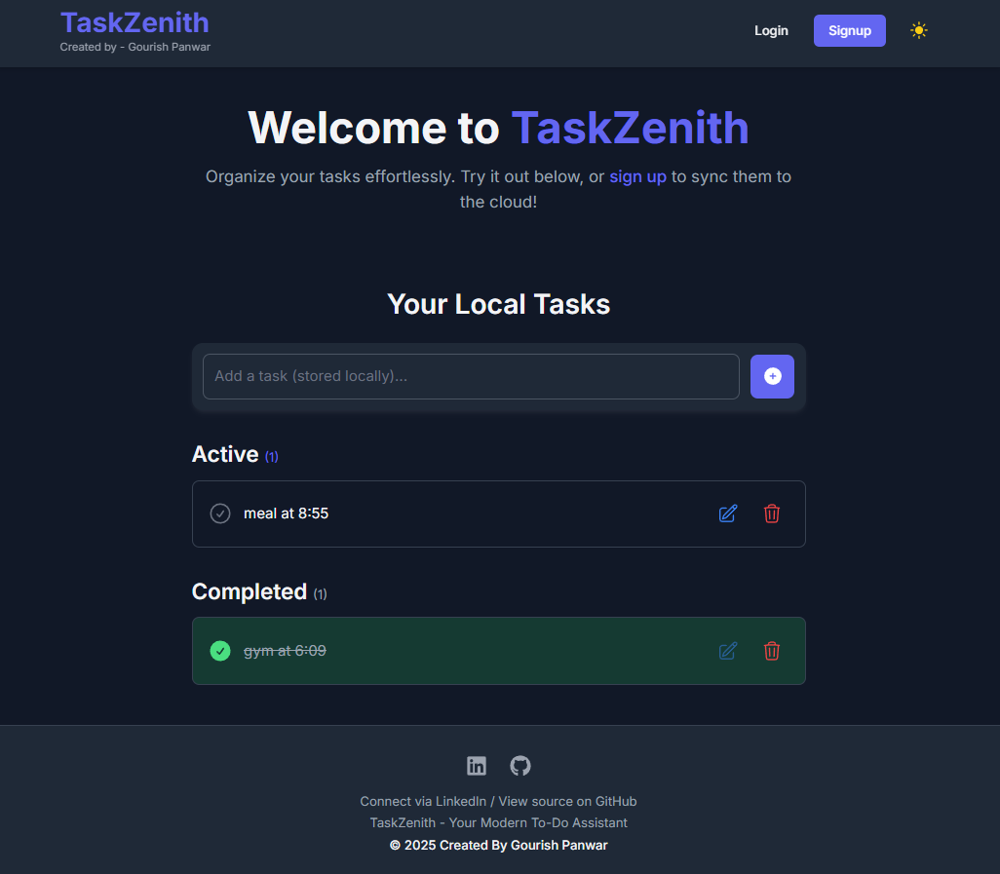
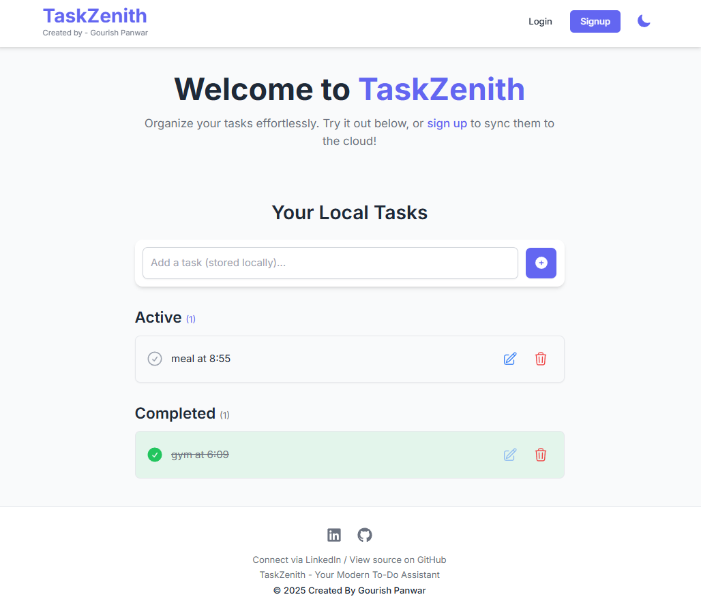
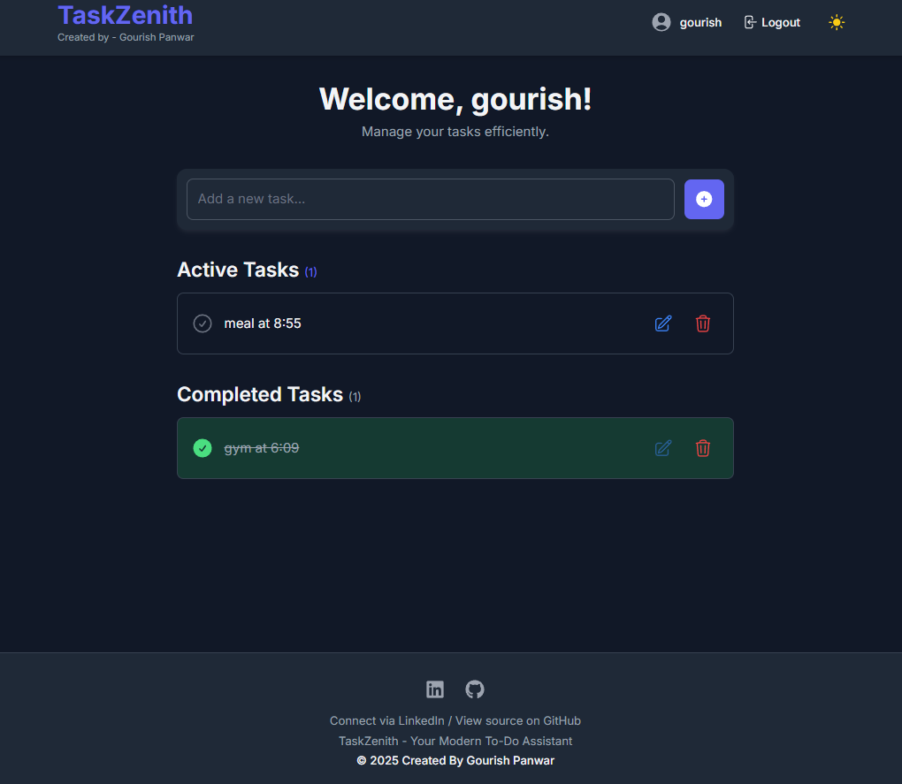

# TaskZenith - Your Modern & Beautiful To-Do App ✨📝

## Live Demo - [Try TaskZenith Now!](YOUR_VERCEL/NETLIFY_DEPLOYMENT_URL_HERE)

TaskZenith is a sleek, modern, and visually stunning To-Do application built with React, Vite, and Firebase. It offers a seamless experience for managing your tasks, whether you're a guest user or signed in to sync your tasks to the cloud. Designed with a default dark theme and an optional light theme, TaskZenith is fully responsive for desktop, tablet, and mobile use.







## Overview

TaskZenith is designed to be more than just a To-Do list; it's your personal productivity hub. Key features include:

*   **Guest User Experience:** Add and manage tasks locally without an account. Your tasks are saved in the browser's local storage.
*   **Account System:** Securely sign up, log in, and log out using Firebase Authentication (Email/Password).
*   **Cloud Sync:** Signed-in users have their tasks stored and synced in real-time with Firebase Firestore, accessible from any device.
*   **Automatic Task Migration:** If you start as a guest and then sign up or log in, your local tasks are automatically migrated to your cloud account.
*   **Stunning UI/UX:** A focus on modern aesthetics, smooth animations, and a delightful user experience.
*   **Dual Themes:** Defaults to a beautiful dark theme with an easy toggle for a clean light theme. Theme preference is saved locally.
*   **Responsive Design:** Flawlessly adapts to desktop, tablet, and mobile screens.
*   **CRUD Functionality:** Full Create, Read, Update, and Delete capabilities for your tasks.

The goal was to create a To-Do app that is not only highly functional but also a joy to look at and use every day.

## Features

*   **User Authentication:**
    *   Secure Email/Password Signup & Login.
    *   Persistent login sessions.
    *   User profile display (name/email).
*   **Task Management (Cloud - Signed-in Users):**
    *   Add, edit, complete, and delete tasks.
    *   Real-time synchronization across devices via Firebase Firestore.
    *   Tasks securely stored per user.
*   **Task Management (Local - Guest Users):**
    *   Add, edit, complete, and delete tasks.
    *   Tasks stored in browser `localStorage`.
*   **Automatic Local-to-Cloud Task Migration:** Seamlessly transfers tasks upon first login/signup.
*   **Theming:**
    *   Default "jaw-droppingly beautiful" Dark Theme.
    *   Switchable Light Theme.
    *   Theme preference saved in `localStorage`.
    *   Smooth theme transition effects.
*   **UI & UX:**
    *   Modern and clean interface.
    *   Intuitive navigation.
    *   Responsive design for all screen sizes.
    *   Interactive elements with hover effects and transitions.
    *   Customized scrollbars for a polished look.
*   **Header & Footer:**
    *   Sticky header with app title, creator credit, navigation, and theme toggle.
    *   Footer with social links and project information.
*   **Single Page Application (SPA):** Fast and fluid navigation using React Router.

## Tech Stack

*   **Frontend Framework:** React 18+ (with Hooks)
*   **Build Tool:** Vite
*   **Styling:** TailwindCSS (for utility-first CSS and beautiful design)
*   **State Management:** React Context API (for Auth and Theme)
*   **Routing:** React Router DOM v6
*   **Backend as a Service (BaaS):** Firebase
    *   **Authentication:** Firebase Auth (Email/Password)
    *   **Database:** Firebase Firestore (for cloud-synced To-Dos)
*   **Language:** JavaScript (ES6+)
*   **Icons:** Heroicons, React Icons (for UI elements and social links)
*   **Package Manager:** npm
*   **Deployment (Example):** Vercel, Netlify, Firebase Hosting

## Getting Started

To get a local copy up and running, follow these simple steps.

### Prerequisites

*   Node.js (v16 or newer recommended, which includes npm) installed on your system. Download from [nodejs.org](https://nodejs.org/).
*   Git (for cloning the repository).
*   A Firebase project set up with Authentication (Email/Password enabled) and Firestore (started in test mode initially, then secured with provided rules).

### Firebase Setup

1.  Go to the [Firebase Console](https://console.firebase.google.com/).
2.  Create a new project (or use an existing one).
3.  Add a Web App to your Firebase project.
4.  Enable **Authentication** > Sign-in method > **Email/Password**.
5.  Enable **Firestore Database** > Create database.
    *   Start in **Test Mode** for initial development.
    *   Note your Firebase project configuration (apiKey, authDomain, projectId, etc.).
6.  Once the app is running, update Firestore **Rules** with the secure rules provided in the project or development guide to protect user data.

### Installation & Local Setup

1.  **Clone the repository:**
    ```bash
    git clone https://github.com/gourishpanwar/task-zenith-todo.git
    cd task-zenith-todo

    ```

2.  **Install NPM packages:**
    ```bash
    npm install
    ```

3.  **Configure Firebase:**
    *   Create a file named `firebase.js` in the `src` directory: `src/firebase.js`.
    *   Paste your Firebase project configuration into it:
        ```javascript
        // src/firebase.js
        import { initializeApp } from "firebase/app";
        import { getAuth } from "firebase/auth";
        import { getFirestore } from "firebase/firestore";

        const firebaseConfig = {
          apiKey: "YOUR_API_KEY",
          authDomain: "YOUR_AUTH_DOMAIN",
          projectId: "YOUR_PROJECT_ID",
          storageBucket: "YOUR_STORAGE_BUCKET",
          messagingSenderId: "YOUR_MESSAGING_SENDER_ID",
          appId: "YOUR_APP_ID"
        };

        const app = initializeApp(firebaseConfig);
        const auth = getAuth(app);
        const db = getFirestore(app);

        export { auth, db };
        ```
    *   **Important:** Replace the placeholder values with your actual Firebase config.

### Running the Project

1.  **Start the development server:**
    ```bash
    npm run dev
    ```
    This command will start the Vite development server.

2.  **Open the application:**
    Open your web browser and navigate to the local URL provided by Vite (usually `http://localhost:5173/`).

## Project Structure (Key Files & Folders)

```
taskzenith-app/
├── public/                  # Static assets
├── src/
│   ├── assets/              # Image assets, etc. (if any beyond public)
│   ├── components/          # Reusable React components (Header, Footer, TodoItem)
│   ├── contexts/            # React Context for Auth, Theme
│   ├── pages/               # Page-level components (HomePage, LoginPage, DashboardPage)
│   ├── services/            # Logic for Firebase & LocalStorage interactions (todoService, localTodoService)
│   ├── App.jsx              # Main App component with routing
│   ├── firebase.js          # Firebase configuration
│   ├── index.css            # Global styles & Tailwind directives
│   ├── main.jsx             # Entry point of the React application
├── .gitignore
├── index.html               # Main HTML template for Vite
├── package.json
├── postcss.config.js        # PostCSS configuration (for Tailwind)
├── tailwind.config.js       # TailwindCSS configuration
├── README.md                # This file
└── vite.config.js           # Vite configuration
```

## Firestore Security Rules

Ensure your Firestore database is secured. Apply the following rules in your Firebase project console (Firestore Database > Rules):

```javascript
// Firestore Security Rules
rules_version = '2';

service cloud.firestore {
  match /databases/{database}/documents {
    match /users/{userId} {
      allow create: if request.auth != null && request.auth.uid == userId;
      allow read: if request.auth != null && request.auth.uid == userId;
      allow update: if request.auth != null && request.auth.uid == userId;
      allow delete: if false; // Or specific admin/server-side logic

      match /todos/{todoId} {
        allow read: if request.auth != null && request.auth.uid == userId;
        allow create: if request.auth != null && request.auth.uid == userId
                        && request.resource.data.userId == request.auth.uid;
        allow update: if request.auth != null && request.auth.uid == userId;
        allow delete: if request.auth != null && request.auth.uid == userId;
        // Add further data validation as needed for 'create' and 'update'
      }
    }
  }
}
```

## Contributing

Contributions, issues, and feature requests are welcome! Feel free to fork the project, create a feature branch, and open a pull request.

1.  Fork the Project
2.  Create your Feature Branch (`git checkout -b feature/AwesomeNewFeature`)
3.  Commit your Changes (`git commit -m 'Add some AwesomeNewFeature'`)
4.  Push to the Branch (`git push origin feature/AwesomeNewFeature`)
5.  Open a Pull Request

## License

Distributed under the MIT License.

## Acknowledgements

*   **React Team:** For the fantastic UI library.
*   **Vite Team:** For an incredibly fast build tool and dev experience.
*   **TailwindCSS Team:** For a utility-first CSS framework that makes styling a breeze.
*   **Firebase Team:** For providing robust backend services.
*   **Heroicons & React Icons:** For beautiful and easy-to-use icons.
*   **You (The User/Developer):** For checking out TaskZenith!

---

Built by Gourish Panwar - [LinkedIn](https://www.linkedin.com/in/gourish-panwar-1706702b0) | [GitHub](https://github.com/gourishpanwar)
